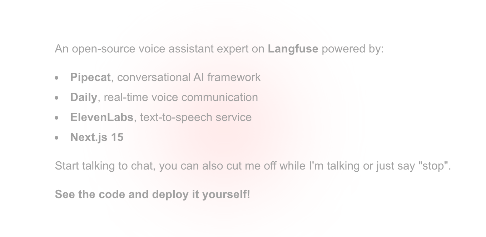

# Langchat



## Setup

### Running the server

1. Configure environment variables

   Create a `.env` file:

   ```sh
   cd server
   cp env.example .env
   ```

   Then fill in the values.

2. Install dependencies (uses [`uv`](curl -LsSf https://astral.sh/uv/install.sh | sh))

   ```sh
   uv sync
   ```

3. Run the bot:

   ```sh
   uv run bot.py --transport daily # we're using daily.co for Real-Time communications
   ```
### Running the client

1. Configure environment variables

   Create a `.env` file:

   ```sh
   cd client
   cp env.example .env
   ```

   Then fill in the values.

2. Install dependencies

   ```sh
   npm install
   ```

3. Run the client

   ```sh
   npm run dev
   ```

Open [http://localhost:3000](http://localhost:3000) with your browser to see the result.

### Deploying to production?

Follow the instructions to [deploying the server](https://docs.pipecat.ai/deployment/overview) and [deploying the frontend app](https://vercel.com/docs/frameworks/full-stack/nextjs).
